  

## ✉️ Contatos:

## 🚀 Sobre Mim

Profissional multidisciplinar na interseção entre **Engenharia de Software, Cibersegurança e Negócios**. Experiência no ciclo completo de desenvolvimento e com forte foco em SecOps e automação de processos. Vivência com infraestrutura em nuvem, gestão comercial e liderança de equipes.

## 💻 Linguagens Principais Usadas:

## ⚙️ Linguagens, Ferramentas e Skills:

## 📘 Estatísticas do GitHub:

<picture>
  <source
    srcset="https://github-readme-stats.vercel.app/api?username=pedropauloat-sys&show_icons=true&theme=dark&rank_icon=github&icon_color=00F9F0&text_color=FFFFFF&title_color=00F9F0&bg_color=050a15"
    media="(prefers-color-scheme: dark)"
  />
  
</picture>

## 🏆 Projetos em Destaque:

